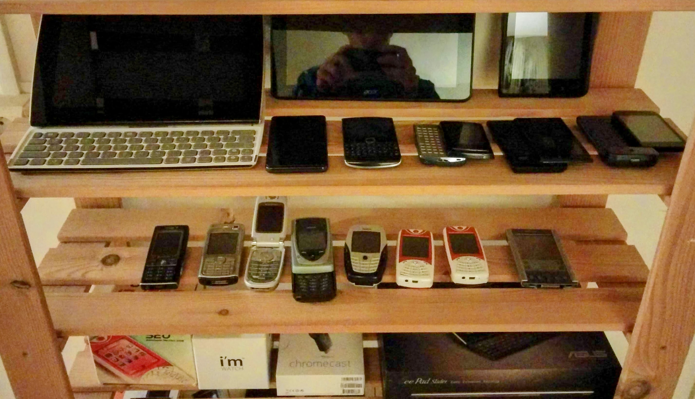

# Hardware

## [System76 Serval WS](https://system76.com/laptops/serval)

```plaintext
CPU: 5.8 GHz i9-14900HX
RAM: 96 GB DDR5 5600 MHz
Screen: 17.3" Matte 2K QHD
Storage: 4 TB
```

## [Pixel 8 Pro](https://store.google.com/product/pixel_8_pro)

```plaintext
CPU: ARMv9 Google Tensor G3
RAM: 12 GB 
Screen: 6.7" Super Actua QHD
Storage: 128 GB
```

## Pixel Watch

```plaintext
CPU: 1.15 GHz ARM Cortex-M33
RAM: 2 GB
Storage: 32 GB
```

## Raspberry Pi 5

```plaintext
CPU: 2.4 GHz ARM Cortex-A76
RAM: 8 GB
Storage: 2x2 GB USB drives (RAID)
Sensors: Webcam, DHT22 (Temperature & Humidity), Microphone
```

## Arduino Nano

## Bose Quiet Comfort 35 Series 2

## Older Devices (incomplete)

```plaintext
Pixel 5
Pixel XL
Nexus 5
Nexus 6
Nexus 7
Moto 360
I'm Watch
LG Optimus 3D Max P720
Asus eee pad Slider SL101
Sony Ericsson LiveView
Acer beTouch E210
Samsung Galaxy Tab P1000
Sony Ericsson X10 Mini Pro
Motorola Milestone
Android Developer Phone 1

Savaje Jasper S20
Nokia 6600
Nokia 7650
Sony Clie PalmPilot

MacBook Pro 13" (2017)
MacBook Pro 21" (2012)
MacBook (2009)
Dell Laptop
Pentium ]|[
Pentium 90
486DX33
386
VIC-20
CPM/86
```


My 4 computers ~1996




My Android devices ~2012
