# Hardware


## System76 Serval WS

[System 76](http://www.system76.com)

```plaintext
CPU: 5.8 GHz i9-14900HX
RAM: 96 GB DDR5 5600 MHz
Screen: 17.3" Matte 2K QHD
Storage: 4 TB
```

## Pixel 8 Pro

```plaintext
CPU: ARMv9 Google Tensor G3
RAM: 12 GB 
Screen: 6.7" Super Actua QHD
Storage: 128 GB
```

## Pixel 5

```plaintext
CPU: Octa-core Kryo 475
RAM: 8 GB LPDDR4X
Screen: 6" FHD+ OLED
Storage: 128 GB UFS 2.1
```

## Pixel Watch

```plaintext
CPU: 1.15 GHz ARM Cortex-M33
RAM: 2 GB
Screen: 41mm AMOLED
Storage: 32 GB
```

## Raspberry Pi 5

[Raspberry Pi 5](https://www.raspberrypi.com/products/raspberry-pi-5/)

```plaintext
CPU: 2.4 GHz ARM Cortex-A76
RAM: 8 GB
Storage: 2x2 GB USB drives (RAID)
Sensors: Webcam, DHT22 (Temperature & Humidity), Microphone
```

## Arduino Nano

[Arduino Nano](https://docs.arduino.cc/hardware/nano/)

```plaintext
CPU: 16 MHz ATmega328P
RAM: 32 KB Flash, 2 KB SRAM, 1 KB EEPROM
Modules: RTC DS1307, Mod4 Max7219 8x32LED
```


## Bose QuietComfort 35 II

[Bose QuietComfort 35 II](https://global.bose.com/content/consumer_electronics/b2c_catalog/worldwide/websites/en_ae/product/qc35_ii.html)

## Older Devices (incomplete)


---

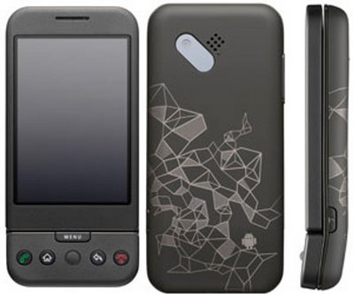

Android Developer Phone 1, Android 1.6

January 5th, 2009

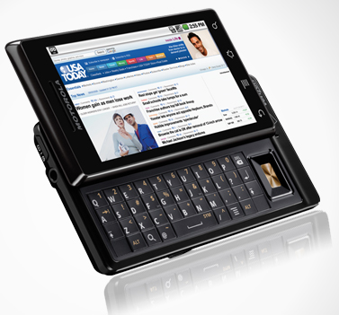

Motorola Milestone, Android 2.2

December 15, 2009

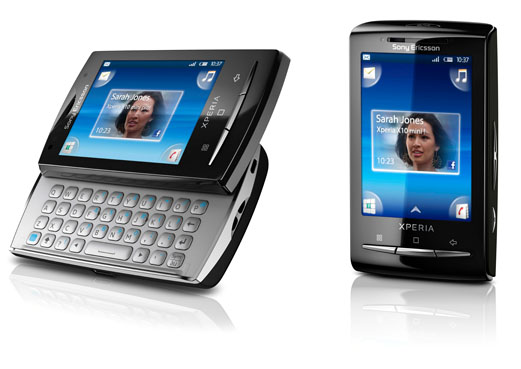

X10 Mini Pro, Android 2.1

July 2nd, 2010

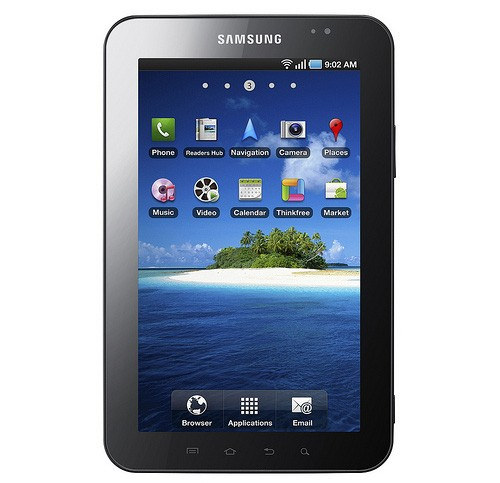

Samsung Galaxy Tab, Android 2.3.6

November 5th 2010

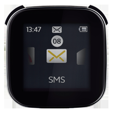

LiveView

Oct 7th 2011

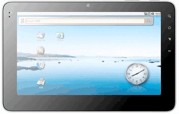

GoCal, Android 2.2

November 12th 2011 

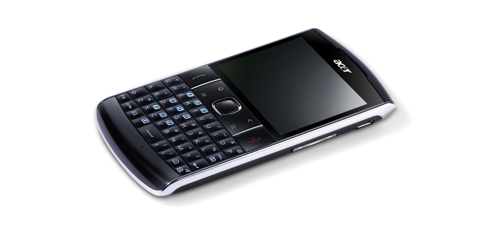

Acer beTouch E210, Android 2.2.2

August 30th 2011

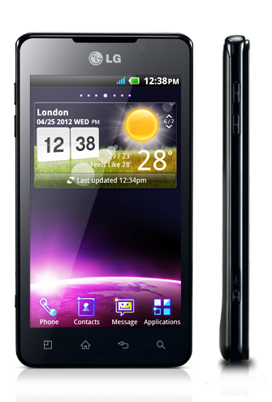

LG Optimus 3D Max P720, Android 2.3.6

June 2012

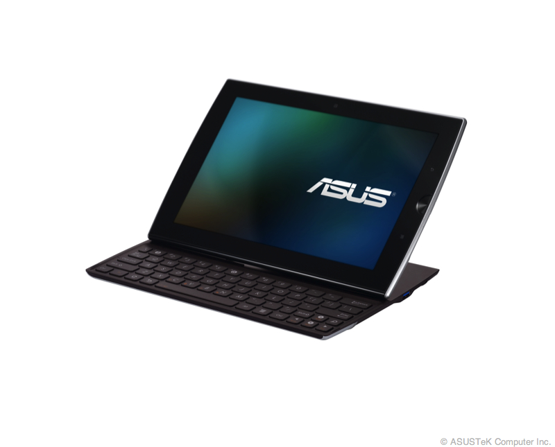

Asus Eee Pad Slider SL101, Android 4.0.3

December 8th 2011

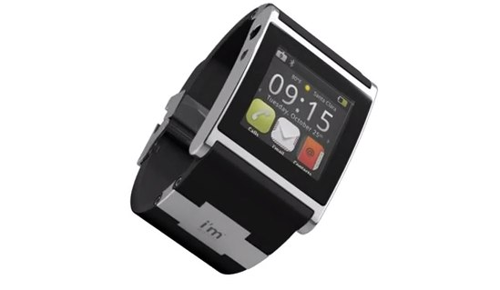

I'm Watch Color

August 2012

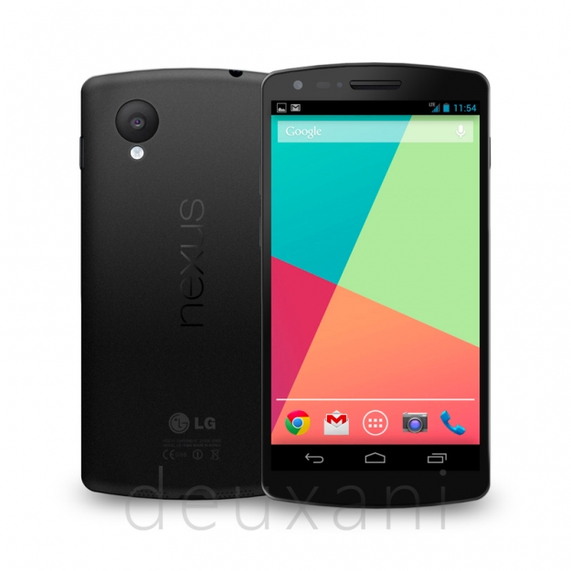

Nexus 5, Android 4.4.2

April 2014


Moto 360

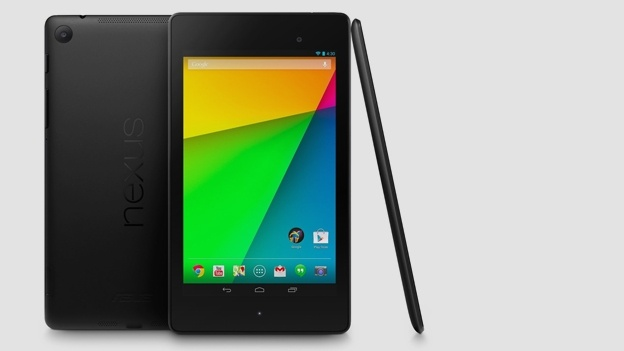

Nexus 7

April 2014


Nexus 6

September 2015


Pixel XL

November 2016

---


Nokia 6600

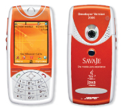

Savaje Jasper S20

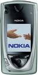

Nokia 7650

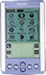

Sony Clie PEG-S300

---

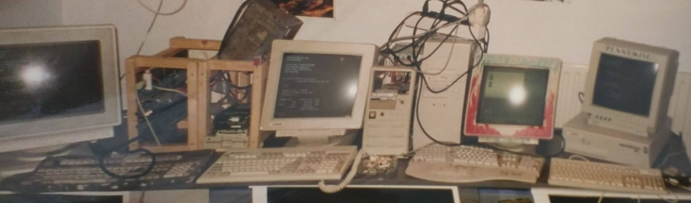

My 4 computers in 1996 or 1997 (connected by BNC ethernet)

Pentium 90, 486DX33, 386, Rekenhout

---

I have also owned these devices:

* MacBook Pro 13" (2017)
* MacBook Pro 21" (2012)
* MacBook (2009)
* Dell Laptop
* Pentium ]|[
* [VIC-20](https://en.wikipedia.org/wiki/VIC-20)
* [CP/M-86](https://en.wikipedia.org/wiki/CP/M-86)


