# Android

{:toc}

# GraphView (2010)

GraphView is a custom View which easily creates Graphs.Just supply an array of values and they will be displayed in the graph.
The graph automatically scales the values between the highest and the lowest in the supplied set.
Labels are shown along the X and Y axis.
The first and last label on the X axis are intentionally not centered in order to use less screen space.

[https://github.com/arnodenhond/GraphView/](https://github.com/arnodenhond/GraphView/)

---

# Event Schedule Map (2009)

Informational application for visitors of conferences. Browse list of events and request notifications, view a map of the area, browse various additional information

## Hacking at Random 
[http://www.har2009.org/](har2009.org)

The main screen has different layouts for landscape and portrait.
Six buttons at the top open various screens and two tabbed pages at the bottom show which events are going on now and which are starting next (one event for each location).

The events list can be sorted in two ways
 * By Location. The track is shown as subtitle.
 * By Track (shown below). The location is shown as subtitle.

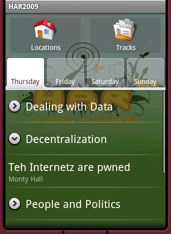

Clicking on an event brings up the event details screen.
This screen can also be accessed through the now and next lists in the main screen.
The button at the bottom allows the user to add or remove this event to his/her personalized schedule.

All marked events can be reviewed in the notifications screen.
The application does not automatically check for time conflicts.
The events in this list are not grouped by location or track.
Clicking on an event brings up the event details screen.

Ten minutes before a selected event starts the user will be notified.
Notifications are stored in the database and are restored if the device restarts.
Clicking on the notification brings up the event details screen.

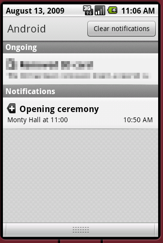

The map feature shows an stylized map image of the area.
A selecting an item from the list of points of interest indicates that items position on the map.

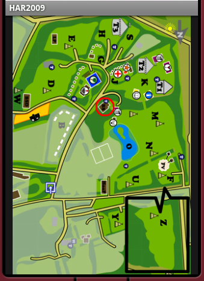

The information screen shows some random information about the event.
Buttons start the maps, browser or dialer application.

The villages screen shows a list of groups of participants.

The phonebook screen shows a list of phone numbers of organisors and participants.
Clicking on an entry starts the dialer application.

[HAR2009.apk](HAR2009.apk)

## MRMCD0x8
For the MetaRheinMain ChaosDays 0x8 conference an app similar to the app for HAR2009 has been created.
The conference took place from 4 to 6 september 2009 at TU Darmstadt in Germany.
[mrmcd0x8.metarheinmain.de](mrmcd0x8.metarheinmain.de)

## J-Fall
[https://nljug.org/](Nederlandse Java User Group)

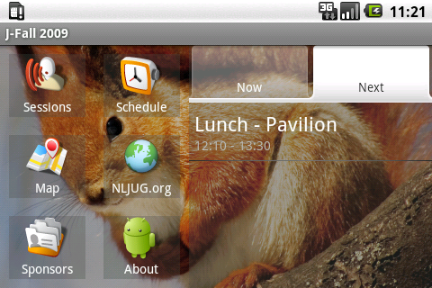

The schedule menu shows all activities of the entire day.
For each timeslot the selected session is displayed.

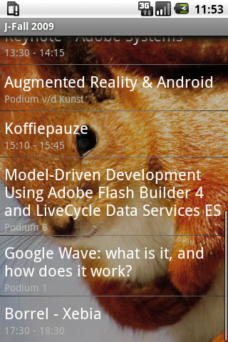

The sessions menu works a bit different than in the other versions.
First an overview is shown which allows you to either view a session or a timeslot with a number of simultanious sessions.
Select your preferred session for each timeslot. Clicking on a session allows you to view it.

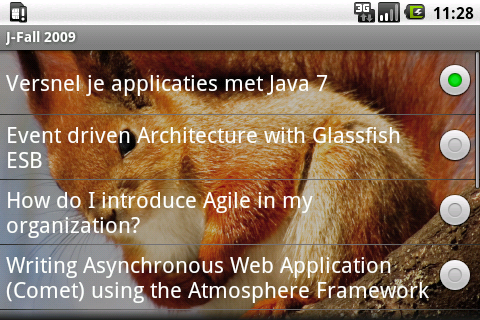

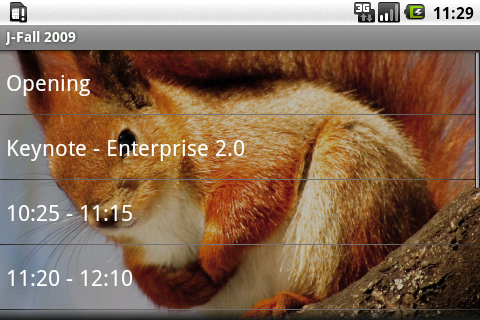

---

# Quick Search Box Tools (2010)

5 tools (Calendar, Twitter, Calculator, URL, Currency) which transform QSB into Quick Command Box to allow quick and easy input of data without opening any apps.

Review: [https://androidguys.com/reviews/app-reviews/app-review-qsb-add-ons/](https://androidguys.com/reviews/app-reviews/app-review-qsb-add-ons/)

These apps are used through the Quick Search Box.
They try to transform it into a Quick Command Box.
The intended benefit is that a user no longer needs to navigate through an app to perform a common task.

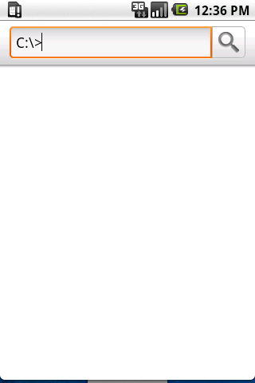
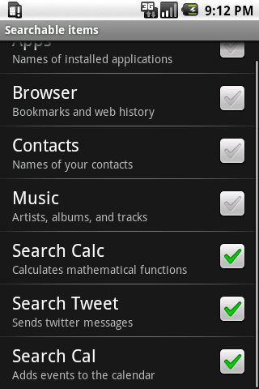

## Calculator
Use the Quick Search Box (QSB) for a quick math calculation.
Calculation result is shown in the suggestions list below the searchbox.
Opening the calculator app is not required.
Search Calculator supports many mathematical functions.
Requires Android 1.6 (Donut)

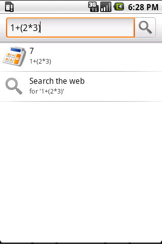

## Currency Converter
Use the Quick Search Box (QSB) to easily convert currency.
Define a default input currency and several output currencies.
Justtype the amount and see the converted amounts in the suggestions list.Also allows easy non-default conversions such as "10 usd to eur"
Supports 64 currencies. Uses live data from Google Finance

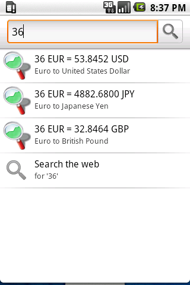

## Calendar Input
Use the Quick Search Box (QSB) to add a new event in the calendar.
Describe a new event by typing something like "Sat 9pm to 23.30 party time at my place" to create a new event on the next saturday from 9 to 11:30 pm with the subject set to "party time" and the location set to "my place".
Search Calendar will show one suggestion for each calendar below the search box. Selecting a suggestion will save it to the appropriate calendar.
It takes a little practice to get used to the input format.

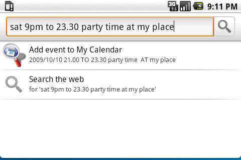

## Tweet Post
Use the Quick Search Box (QSB) to send a twitter message.
Select the Send Tweet option from the suggestions list below the searchbox.
Opening the twitter app is not required.
Search Tweet requires Twidroid and Android 1.6 (Donut)

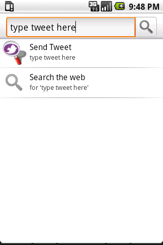

## URL Shortcut
Use Quick Search Box (QSB) to execute a URL with an inserted parameter.
Create your own shortcuts, define their urls and where to insert the query from QSB.
Select the suggestion result to launch the url.
SearchUrl supports any protocol for which an app is installed.
For advanced users only!

---

# Teletext (2010)

Review: [https://www.bright.nl/nieuws/1111593/de-20-beste-android-apps.html](https://www.bright.nl/nieuws/1111593/de-20-beste-android-apps.html)

Teletext has [Teletext](https://en.wikipedia.org/wiki/Teletext) pages for over 148 channels from over 28 countries.
Create bookmarks to easily access your favourite pages.
Navigate between pages using touchscreen gestures.

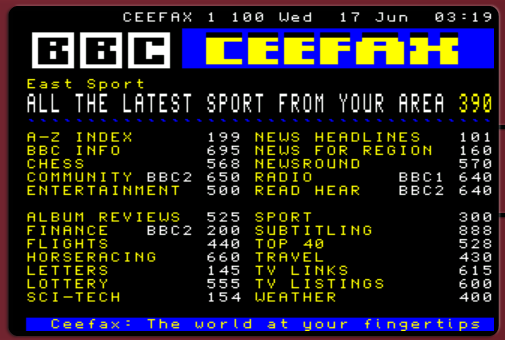

[Teletext.apk](Teletext.apk)

---

# ReBro (2012)

UDP multicast broadcast bridge using [Samsung Cord Library](https://news.samsung.com/global/samsung-developers-conference-2013-introducing-samsung-chord-and-group-play)

[ReBro.zip](ReBro.zip)

## SymChat
Fully permissionless symmetric chat app

[SymChat.zip](SymChat.zip)

---

# I’m Watch Sync Emulator (2013)

When developing apps for [I'm_Watch](https://en.wikipedia.org/wiki/I'm_Watch) configuration can be done through the I'm Cloud web interface.
The app receives the configuration data (formatted as JSON) through a broadcast when the system completes the periodic synchronization with I'm Cloud.

This small app emulates the broadcast sent by the system and can be used for testing if the app correctly receives the synchronization.
The app allows input of the JSON as used by I'm Cloud, then it shows an input field for each configuration entry allowing you to set each value (similar to how i'm cloud could allow the user to configure the app), then it produces the output configuration JSON which is broadcast to the receiving app.

[Source](https://github.com/arnodenhond/SyncEmu/)

---

# Notificonsole

Execute commands on the command prompt from your notification panel.

---

# SendText 

Send Text sends text to any app that can send text. Type first, select an app later!
SendText allows you to send text to any app on your phone or tablet (that can send text) directly from a notification launched by a Quick Settings tile.
Post a message to google+ or twitter, send a text message or email, create a qr code or a note, all without opening any apps but simply by typing into the notification.
Usage: Either paste from clipboard or start typing and press enter. Simply select an app to launch the app with your message pre-filled.
Direct Share: Send Text makes use of Android 6.0's Direct Share feature to allow sending text directly to a certain contact within an app that can send text.
Important: Send text is started through a Quick Settings tile which you need to add to your Quick Settings panel before use.
Disclaimer: Send Text is only 13kb. It has no permissions, background activities or advertisements. 

[Source](http://github.com/arnodenhond/sendtext)

later added as a system feature

---

# LiveFolder Shortcut

For some reason LiveFolders have been removed from the default launcher app since Honeycomb but LiveFolder Shortcut brings them back! 
Create a Shortcut (for some reason called Widget since Honeycomb) and select LiveFolder Shortcuts to list the available Live Folders installed on your system.
Select a Live Folder to add it to the launcher as a shortcut. 
Launching the shortcut opens the LiveFolder content provider List Activity.
Select an item from the list to start the LiveFolder's intent.

[Source](http://code.google.com/p/livefolder-shortcut)

[https://android-developers.googleblog.com/2009/04/live-folders.html](https://android-developers.googleblog.com/2009/04/live-folders.html)

---

# Bright

An app to read the articles of the magazine [Bright](http://www.bright.nl/bright-app)
Also plays videos in the media player or youtube, downlaods applications from the market, allows posting responses and article url forwarding through twitter or email.

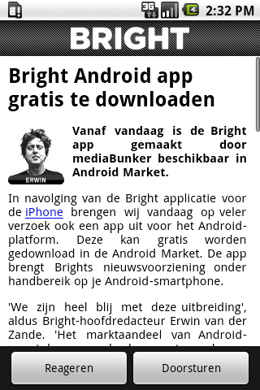
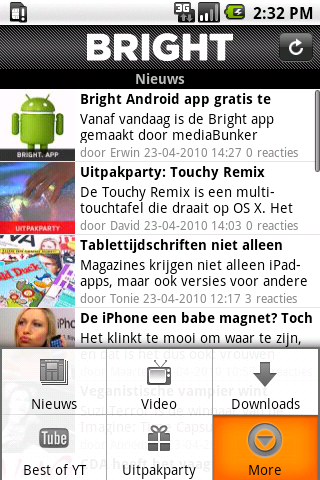

---

# GamesPlaza

Website "launcher" app for gamesplaza.mobi shows website in an Android app.
Launches Android Market for app downloads.
Launches Browser for ring tone and wallpaper downloads.
Options menu shows several shortcuts to different parts of the website.
Developed for [The Saints](the-saints.nl)

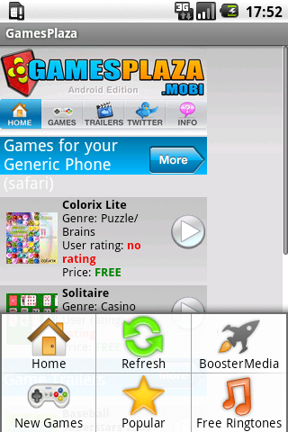

---

# ShipItSmarter

Reads one or more bar codes. (Requires barcode scanner app)
Optionally uses camera app to take a picture.
A list of URLs to call HTTP POST on.
Inserts the scanned barcode(s) and latitude/longitude and IMEI of the device into the URL.
If a picture was taken, is it sent as the body of the request.
A result page is shown when the call completes.

Contact [http://ShipitSmarter.com](ShipitSmarter.com) for availability.

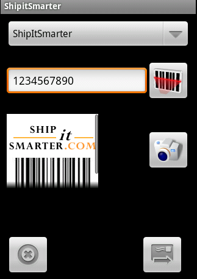

---

# HelloArnoid

My very first application! Compiled on January 29, 2009. Does nothing but display the text "hello arnoid" on the screen. 

[helloarnoid.apk](helloarnoid.apk)

