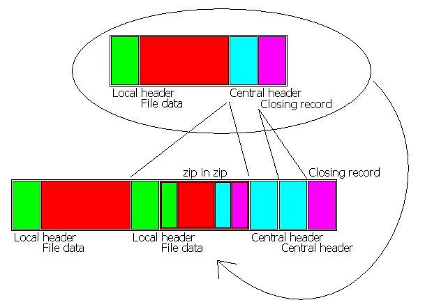
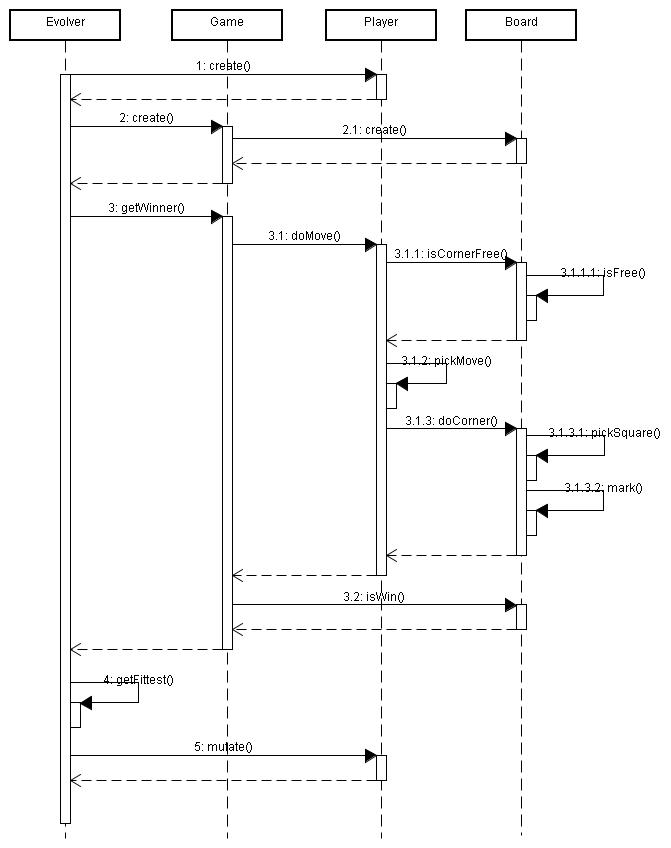
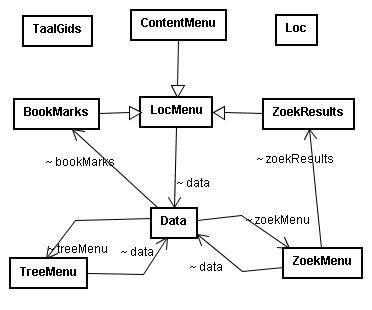

# J2ME

{:toc}

## Self-Replication (2006)

[source](ZipReinserter.java)

### KettingBrief

Chain Letter. Self replication demonstrator

[[KettingBrief.jar](KettingBrief.jar)

### SMS Cash

Pyramid Scheme with payment by SMS. 

[SMSDonatie.jar](SMSDonatie.jar)
  
### Evolvagotchi

bluetooth replication, genetic algorithm

[Evolvagotchi](evolvagotchi.html)
    
## TaalGids (2005)

fancy ui, mmapi

[taalgids.zip](taalgids.zip)
    
## CashLog
MIDlet for palm or phone to record and display personal finance data

standalone zql, history graph

[ASS.jar](ASS.jar)
[source](ASS_source.zip)
    
## W-Mobile (2009)
    
## BelBios (2003)

Three part system to spider a wap site, process data and serve it to a mobile client

## TV-Guide

program that downloads a bunch of wml pages and represents data in a better searchable way

[tvgids.zip](tvgids.zip)

[BelBios.zip](BelBios.zip)
    
## Dungeons & Dragons Tools (2003)

Unfinished dungeons & dragons player tool.

Character sheet and various tools and calcuators.

[DDPT.zip](DDPT.zip)

## Examine

Questionnaire client includes XML to datastream converter

[examine.zip](examine.zip)

## KnikkerSpel

Marble/checkers game

[KnikkerSpel.jar](KnikkerSpel.jar)
[source code](KnikkerSpel.zip)

