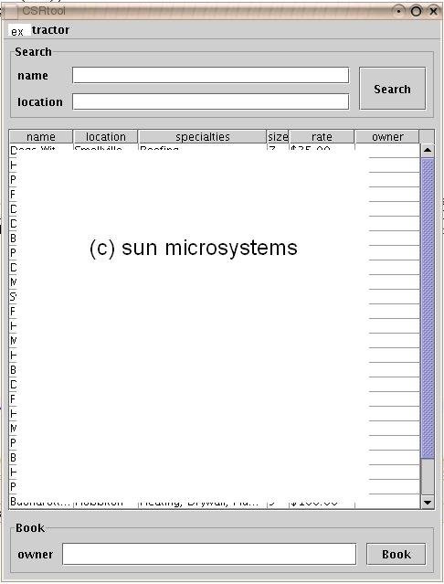
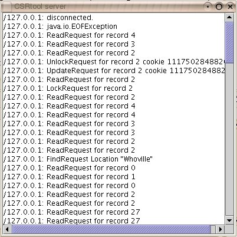
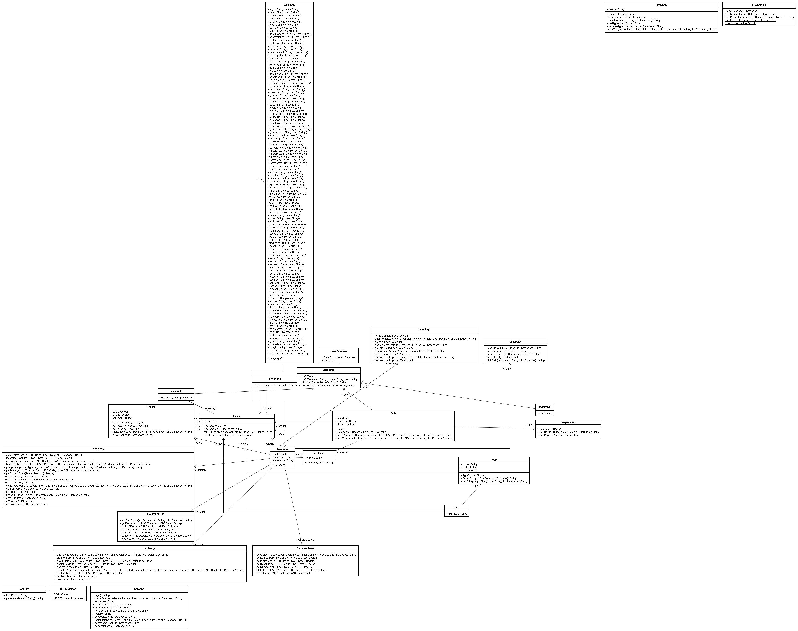
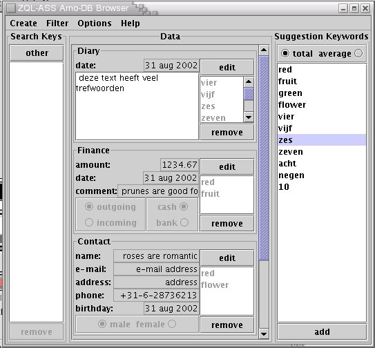
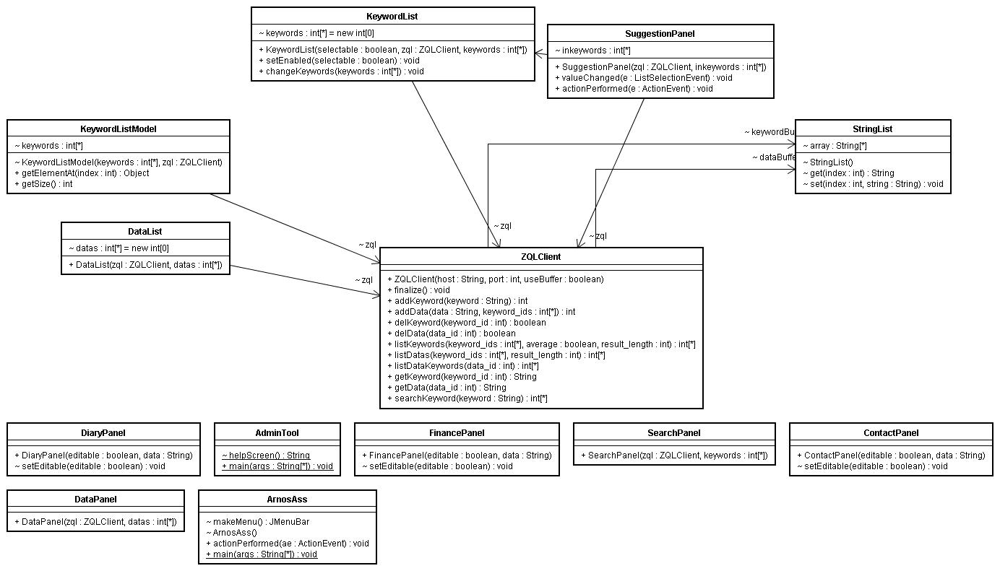
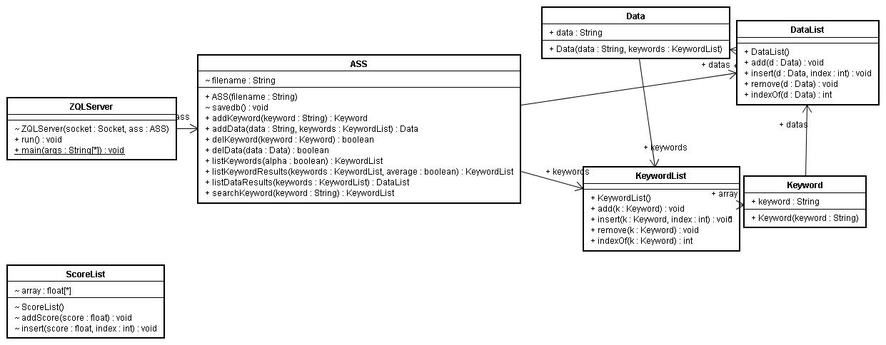

# Java

{:toc}

## CSRtool user documentation (2005)
  
Sun Certified Java Developer Assignment
  

[extractor.zip](extractor.zip)

[user guide](userguide.html)

[choices](choices.txt)
    
## SRSAdmin (2001)
    
Inventory Management & Sales Administration program.

[SRSAdmin23.zip](SRSAdmin23.zip)

[SRSAdmin23_source.zip](SRSAdmin23_source.zip)

[srsabbo.zip](srsabbo.zip)

[readme.txt](readme.txt)
    
## ZQL / ASS (2000)

Zod Query Language / Associative Suggestion Search

web interfaced standalone keyword search 

[AXE](axe.zip)

web search engine that allows setting of a weight to search keywords giving result data and keywords a weighted score.

[Mogguh](mogguh.zip)

[transfer protocol](protocol.txt)

### Client

[arnosass.zip](arnosass.zip)

[admintool.zip](admintool.zip)

 

[javadoc](ZQLClient.html)

[zqlclient.zip](zqlclient.zip)

### Server

[ZQLServer.zip](zqlserver.zip)

### Database

[javadoc](ASS.html)

[ass.txt](ass.txt)

[ass.zip](ass.zip)

## RIKO Admin v1.2

Web interfaced tax administration program

[RIKOAdmin](rikoadmin.zip)
