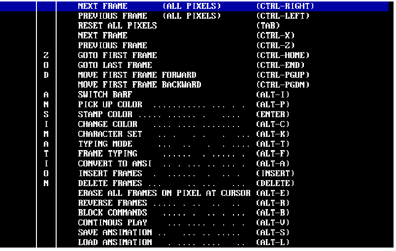

# Turbo Pascal

# Local Access (~1997)

My Bulletin Board System software.

The most popular at the time was [RemoteAccess](https://en.wikipedia.org/wiki/RemoteAccess) but mine was to be more efficient: You would briefly connect to download a database of files that were on offer, browse it offline and select which files you wanted and then connect again for the actual file transfers.

The code for communicating with the modem connected to the COM port was written in Assembler

# ANSImation Editor (~1996)

An improved version of [TheDraw](https://en.wikipedia.org/wiki/TheDraw) for making animating [ANSI](https://en.wikipedia.org/wiki/ANSI_art) art

This was to be the main menu of my Bulletin Board System

Just a small part of a different ansimation. I was the Sysop “Icy-D” and the CoSysop was a classmate

There were numerous advanced features. I don’t remember exactly how it all worked but creating an animation could quickly become extremely complex.

DOS Executable: [zodam.zip](zodam.zip)

# BBS GuestBook (~1996)

A guest book for visitors of my Remote Access BBS

---

# Basic (pre 1995)

There were also innumerable small programs written in GW-Basic and Quick Basic but these have all been lost in the Great Hard Disk Crash of 2001.
